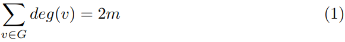
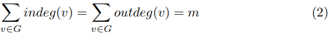

# Graphs: Overview

## Introduction

Graphs are fundamental data structures that represent relationships between objects, consisting of **vertices** (nodes) and **edges** (connections). The origins of graph theory can be traced back to the "Seven Bridges of Königsberg" problem, solved by Leonhard Euler in 1736, marking the foundation of graph theory and topology (Diestel, 2005).

In computer science, graphs play a vital role in modeling relationships, ranging from social networks to computer networks and biology (Cormen et al., 2009). Numerous algorithms have been developed to traverse and analyze graphs, each tailored to different problem-solving approaches.

### Definitions

A graph is a structure used to represent relationships between pairs of objects (Goodrich et al. 2014) or entities. It consists of a set of vertices and a collection of edges. Each edge can optionally carry a weight to represent an arbitrary value, such as cost, distance, or quantity. Vertices (also called nodes) represent entities, while edges represent relationships between them (Xia et al., 2021).

Formally, a graph *G* is defined as a set of vertices *V* and a collection *E* of pairs of vertices (the edges).

A graph may be:

- Directed: Edges are ordered pairs *(u, v)*, where *u* points to *v* (also called a digraph).

- Undirected: Edges are unordered pairs, where *(u, v)* is the same as *(v, u)*.

Some definitions about edges and vertices:

- Adjacent vertices: Two vertices joined by an edge.

- Adjacent edges: Two edges sharing an endpoint.

- Loop: An edge that joins a vertex to itself.

- Two vertices connected by an edge are called endpoints.

- Edges can be represented by a triplet *(u, v, w)*, with *u* and *v* being the endpoints, and *w* the weight.

- The degree of a vertex *v* (*deg(v)*) refers to the number of edges incident to *v*.

- In a directed graph, the in-degree (*indeg(v)*) is the number of edges pointing to *v*, while the out-degree (*outdeg(v)*) is the number of edges leaving *v*.

If *G* is an undirected graph with *m* edges, we have:



In this case, each edge *(u, v)* is counted twice, one for the endpoint *(u)* and another for the endpoint *(v)*.

For a directed graph with *m* edges, then:

:

Here, each edge counts as one unit for the out-degree of the source vertex and one unit for the in-degree of the target vertex.

Consider a simple graph with *n* vertices and *m* edges. If the graph is undirected, then:


The maximum degree of a vertex in this undirected graph is *n - 1*. Thus:


Based on the definition **2**, the maximum degree of a vertex in *G* of a directed graph is:


### Graph Algorithms

- **Breadth-First Search (BFS)**: This algorithm explores nodes level by level, making it useful for finding the shortest path in unweighted graphs (Cormen et al., 2009). It starts at a source vertex and visits all its neighbors before moving to the next level of vertices.

- **Depth-First Search (DFS)**: DFS explores as far as possible along each branch before backtracking, commonly used in topological sorting and cycle detection (Sedgewick & Wayne, 2011).

- **Dijkstra's Algorithm**: This is an efficient algorithm for finding the shortest path in weighted graphs with non-negative edges, using a priority queue to select the next vertex to explore (Even, 2011).

## Implementation Strategies

Graphs can be implemented in different ways, each with its trade-offs in terms of space and time complexity.

The following sections cover three common implementation strategies: **Edge List**, **Adjacenty Matrix** and **Adjacency List**.

For a more detailed exploration, check out my repository [graphs-ds](https://github.com/francisco-ricardo/graphs_ds), which is currently under development.

### Edge List

An **edge list** is a basic representation where all edges are listed as pairs of vertices. For example, an undirected graph with edges *(A, B)* and *(B, C)* would be represented as `[(A, B), (B, C)]`.

- **Space Complexity**: O(E), where E is the number of edges.
- **Edge Lookup**: O(E), since each edge must be checked.

Consider the graph below.


The following table represents the graph above using an Edge List.

| Index | Vertex 1 | Vertex 2 |
|-------|----------|----------|
| 0     | 0        | 1        |
| 1     | 0        | 3        |
| 2     | 1        | 0        |
| 3     | 1        | 2        |
| 4     | 1        | 3        |
| 5     | 2        | 1        |
| 6     | 2        | 3        |
| 7     | 3        | 0        |
| 8     | 3        | 1        |
| 9     | 3        | 2        |

### Adjacency Matrix

An **adjacency matrix** is a 2D array where the cell at row i and column j indicates whether there is an edge between vertex i and vertex j (Sedgewick & Wayne, 2011).

- **Space Complexity**: O(V²), where V is the number of vertices. This approach is more memory-intensive, especially for sparse graphs.

- **Edge Lookup**: O(1), as each connection can be checked directly.

Consider the graph below.


The matrix below  represents the graph above using an Adjacency Matrix.

|    | j1 | j2 | j3 | j4 |
|----|----|----|----|----|
| i1 |  0 | 18 |  0 | 11 |
| i2 | 18 |  0 |  9 | 14 |
| i3 |  0 |  9 |  0 | 25 |
| i4 | 11 | 14 | 25 |  0 |

### Adjacency List

An **adjacency list** is a space-efficient structure where each vertex maintains a list of its adjacent vertices. For instance, a graph where vertex *A* is connected to *B* and *C* would have a list like `A: [B, C]` (Cormen et al., 2009).

- **Space Complexity**: O(V + E), as space grows with both the number of vertices and edges.

- **Edge Lookup**: O(V) in the worst case, but generally faster for sparse graphs.

Consider the graph below.


The block below  represents the graph above using an Adjacency List.

```json
{
    "0": ["1", "3"],
    "1": ["0", "2", "3"],
    "2": ["1", "3"],
    "3": ["0", "1", "2"]
}
```

### Time Complexity of Graph Traversals

- **Breadth-First Search (BFS)** and **Depth-First Search (DFS)** have a time complexity of O(V + E) (Cormen et al., 2009).

- **Dijkstra's Algorithm**: O((V + E) log V), where a priority queue is used to efficiently select the next node (Even, 2011).

## Applications

Graphs are used in various practical applications, ranging from machine learning to social and computer networks.

- **Neural Networks**: Graphs are used to model layers of neurons and their connections. Each node represents a neuron, and the edges represent synaptic connections.

- **Social Networks**: Sites like Facebook or LinkedIn use graph structures where users are nodes, and connections represent friendships or professional relationships (Sedgewick & Wayne, 2011).

- **Computer Networks**: Routers and devices can be modeled as nodes, and network links as edges. Graph-based algorithms are used to optimize routing and traffic control (Cormen et al., 2009).

### Existing Graph-based Solutions

- **Neo4j**: A popular graph database that stores data as nodes and edges, offering efficient querying of relationships in large datasets (Diestel, 2005).

- **Google Maps**: Uses graph algorithms, including Dijkstra’s algorithm, to compute the shortest paths between geographic locations (Even, 2011).

Other notable applications include:

- **Biological Networks**: Graphs are used to model molecular interactions in bioinformatics.

- **Compiler Design**: Directed acyclic graphs (DAGs) help resolve dependencies in compilers (Sedgewick & Wayne, 2011).

- **Recommendation Systems**: Companies like Netflix or Amazon use graphs to model user behavior and item relationships for generating recommendations.

## Conclusion

Graphs are an essential tool in modeling relationships and networks in various fields. Understanding how to efficiently implement and traverse graphs allows developers to build optimized systems for everything from network routing to database design. Through careful selection of implementation strategies and algorithms, we can leverage the full potential of graphs.

## References

- Cormen, T. H., Leiserson, C. E., Rivest, R. L., & Stein, C. (2009). *Introduction to Algorithms*. MIT Press.
- Diestel, R. (2005). *Graph Theory*. Springer.
- Sedgewick, R., & Wayne, K. (2011). *Algorithms*. Addison-Wesley.
- Even, S. (2011). *Graph Algorithms*. Cambridge University Press.
- Goodrich, M. T., Tamassia, R., & Goldwasser, M. H. (2014). *Data structures and algorithms in Java*. John Wiley & Sons.
- Xia, F., Sun, K., Yu, S., Aziz, A., Wan., L., Pan, S., and Liu, H. (2021). *Graph learning: A survey*. IEEE Transactions on Artificial Intelligence, vol. 2, no. 2, pp. 109–127.
